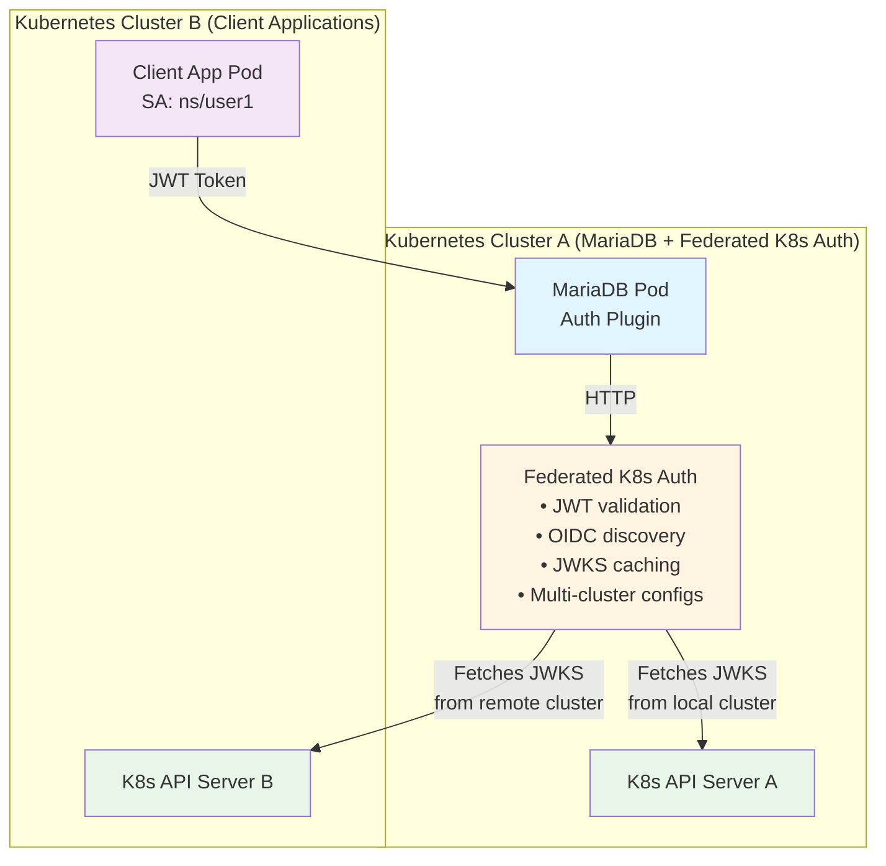
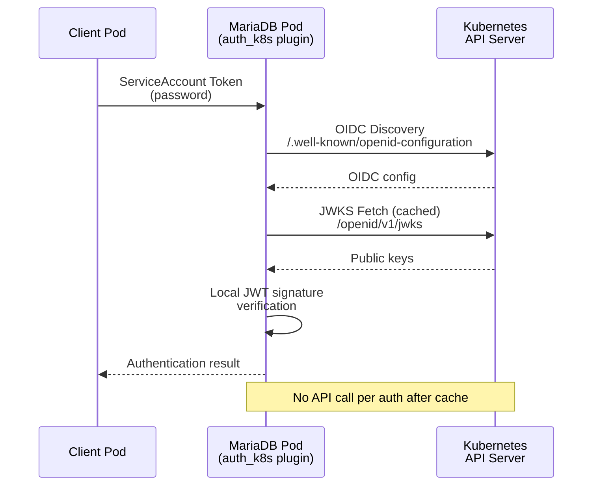
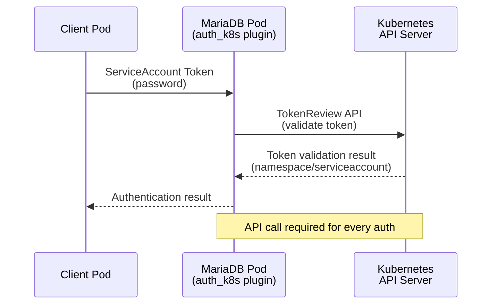

# MariaDB Kubernetes ServiceAccount Authentication Plugin

A MariaDB authentication plugin that validates Kubernetes ServiceAccount tokens, enabling database access control based on Kubernetes identities.

## Features

- **Kubernetes-native authentication**: Uses ServiceAccount tokens instead of passwords
- **Three validation methods**:
  - **Federated K8s Auth** (recommended): Centralized multi-cluster validation service
  - **JWT validation**: Local cryptographic verification with OIDC discovery
  - **TokenReview API**: Validates tokens against Kubernetes API server
- **Multi-cluster support**: Authenticate users from multiple Kubernetes clusters
- **Namespace-scoped users**: Username format `cluster_name/namespace/serviceaccount`
- **Zero password management**: Tokens are automatically mounted by Kubernetes
- **No client plugin required**: Uses built-in `mysql_clear_password` plugin
- **Production-ready**: Built with Node.js (API), C (plugin), libcurl, json-c

## Architecture

### Federated K8s Auth (Production - Recommended)



**Centralized validation, multi-cluster support, operational simplicity**

### JWT Validation (Standalone)



**Local JWT signature verification (no API call per auth)**

### TokenReview API (Optional)



## Validation Methods

### Federated K8s Auth (Recommended - Production)

**How it works:**
- Centralized Node.js service validates JWT tokens
- MariaDB plugin calls API via HTTP
- API performs OIDC discovery and JWT signature verification
- Supports multiple Kubernetes clusters with centralized configuration
- JWKS caching shared across all MariaDB instances

**Pros:**
- **Multi-cluster**: Authenticate users from multiple Kubernetes clusters
- **Simplified plugin**: ~280 lines vs 500+ lines (JWT plugin)
- **Centralized config**: Add/remove clusters without restarting MariaDB
- **Operational simplicity**: Token rotation, JWKS updates affect API only
- **Shared caching**: JWKS cache shared across all MariaDB instances
- **Scalable**: 3-replica deployment with load balancing

**Cons:**
- Additional service to deploy and maintain
- Network hop adds ~5-10ms latency vs local validation
- Requires Federated K8s Auth deployment

**When to use:** Production environments with multiple clusters or complex topology

---

### JWT Validation (Standalone)

**How it works:**
- Fetches OIDC configuration and JWKS public keys from Kubernetes API
- Verifies JWT signatures locally using OpenSSL (RS256)
- Caches JWKS keys (1-hour TTL)
- No API call per authentication

**Pros:**
- **Fast**: Local cryptographic verification (~<1ms)
- **Scalable**: No API call per auth after JWKS cache is warm
- **Reliable**: Works even if Kubernetes API is temporarily slow
- **Single cluster**: Auto-configures for local cluster

**Cons:**
- More complex implementation (~500 lines)
- Single cluster only
- Requires OIDC issuer discovery endpoints (Kubernetes 1.21+)

**When to use:** Single-cluster production environments

---

### TokenReview API (Alternative)

**How it works:**
- Sends token to Kubernetes API for validation
- API call per authentication

**Pros:**
- Simple implementation
- Always validates against latest Kubernetes state
- Supported in all Kubernetes versions

**Cons:**
- **Slower**: API call latency per authentication (~5-10ms)
- **Less scalable**: Kubernetes API load increases with auth rate
- Requires RBAC permissions for TokenReview

**When to use:** Development, testing, or low-traffic environments

## Quick Start

### Prerequisites

- Docker
- kind (Kubernetes in Docker)
- kubectl configured
- skaffold (for Kubernetes deployment)

### Multi-Cluster Testing (Recommended)

The project is configured for multi-cluster testing by default, demonstrating cross-cluster authentication:

```bash
# 1. Create two kind clusters (one-time setup)
make kind

# 2. Deploy everything (MariaDB + Federated K8s Auth to cluster-a, test clients to both clusters)
make deploy

# 3. Run multi-cluster authentication tests
make test

# 4. Clean up when done
make destroy
```

**Quick start:**
```bash
make deploy && make test
```

Expected output:
```
==========================================
Multi-Cluster Authentication Tests
==========================================

==========================================
Test 1: Local Cluster Authentication
==========================================
✅ Test 1 PASSED: Local cluster authentication works

==========================================
Test 2: Direct Cross-Cluster Authentication
==========================================
✅ Test 2 PASSED: Direct cross-cluster authentication works!

==========================================
Test 3: Permission Verification
==========================================
✅ Test 3 PASSED: Permission restrictions work correctly

==========================================
✅ All Multi-Cluster Tests PASSED!
==========================================
```

### Building the Plugin Manually

If you need to build the plugin separately:

```bash
# Download MariaDB headers (one-time setup)
make init

# Build with Federated K8s Auth (production, multi-cluster)
make build-api

# Build with JWT validation (standalone, single-cluster)
make build-jwt

# Build with TokenReview API (alternative)
make build-tokenreview

# Output: build/auth_k8s.so
```

## Project Structure

```
mariadb-auth-k8s/
├── Dockerfile                    # Build environment for plugin
├── Dockerfile.mariadb            # Production MariaDB image with plugin
├── Dockerfile.client             # Test client image
├── Makefile                      # Build automation (multi-cluster workflow)
├── skaffold.yaml                 # Multi-cluster deployment (cluster-a + cluster-b)
├── CMakeLists.txt                # Build configuration
│
├── src/                          # MariaDB plugin source code (C)
│   ├── auth_k8s_validator_api.c  # Federated K8s Auth client plugin
│   ├── auth_k8s_jwt.c            # JWT validation plugin
│   ├── auth_k8s_tokenreview.c    # TokenReview API plugin
│   ├── jwt_crypto.c              # JWT cryptographic validation
│   ├── jwt_crypto.h              # JWT crypto interface
│   ├── tokenreview_api.c         # TokenReview API client
│   └── tokenreview_api.h         # TokenReview API interface
│
├── federated-k8s-auth/          # Federated K8s Auth service (Node.js)
│   ├── Dockerfile                # API service container
│   ├── package.json              # Node.js dependencies
│   ├── src/
│   │   ├── index.js              # Main entry point
│   │   ├── server.js             # HTTP server (Express)
│   │   ├── validator.js          # JWT validation logic
│   │   ├── cluster-config.js     # Multi-cluster configuration
│   │   ├── jwks-cache.js         # JWKS caching with TTL
│   │   └── oidc-discovery.js     # OIDC discovery
│   ├── test/
│   │   └── validator.test.js     # Unit tests (Jest)
│   └── config/
│       └── clusters.example.yaml # Cluster configuration example
│
├── scripts/                      # Scripts
│   ├── download-headers.sh       # Download MariaDB headers
│   ├── setup-kind-clusters.sh    # Create kind clusters
│   ├── setup-multicluster.sh     # Configure multi-cluster authentication
│   └── test.sh                   # Multi-cluster authentication tests
│
├── include/                      # MariaDB server headers (tarball)
│   └── mariadb-10.6.22-headers.tar.gz
│
├── init-auth-plugin.sh           # Plugin installation and user setup script
│
├── k8s/                          # Kubernetes manifests (multi-cluster)
│   ├── cluster-a/                # Cluster A: MariaDB + Federated K8s Auth
│   │   ├── namespace.yaml        # Namespace definition
│   │   ├── rbac.yaml             # RBAC for TokenReview API
│   │   ├── mariadb-nodeport.yaml # MariaDB with NodePort for cross-cluster access
│   │   ├── test-clients.yaml     # Local test clients
│   │   └── token-validator-*.yaml # Federated K8s Auth manifests
│   │       ├── deployment.yaml   # API Deployment (3 replicas)
│   │       ├── service.yaml      # API Service
│   │       ├── serviceaccount.yaml # API ServiceAccount & RBAC
│   │       ├── configmap.yaml    # Cluster configurations
│   │       └── networkpolicy.yaml # Network security policy
│   └── cluster-b/                # Cluster B: Remote test client
│       ├── namespace.yaml        # Namespace definition
│       └── test-client-remote.yaml # Remote test client
│
└── build/                        # Build artifacts (created by make build)
    └── auth_k8s.so               # Server plugin
```

## Makefile Commands

### Build Targets
```bash
make init              # Download and package MariaDB server headers
make build             # Build plugin (Federated K8s Auth, default)
make build-api         # Alias for 'make build'
make build-jwt         # Build plugin with JWT validation
make build-tokenreview # Build plugin with TokenReview API
make clean             # Clean build artifacts
```

### Multi-Cluster Environment
```bash
make kind              # Create two kind clusters (cluster-a, cluster-b)
make deploy            # Setup clusters and deploy everything
make test              # Run multi-cluster authentication tests
make destroy           # Destroy everything (deployments + clusters)
make help              # Show available commands
```

**Multi-cluster test workflow:**
```bash
# Complete workflow
make kind              # Create clusters (one-time)
make deploy            # Deploy everything
make test              # Run tests
make destroy           # Clean up

# Quick iteration (clusters already exist)
make deploy && make test
```

### Architecture

The default setup creates a multi-cluster environment:
- **cluster-a**: Hosts MariaDB + Federated K8s Auth
- **cluster-b**: Hosts remote test client

This demonstrates cross-cluster authentication where a pod in cluster-b authenticates to MariaDB in cluster-a using its ServiceAccount token, validated by the Federated K8s Auth.

## Configuration

### Creating Users

**Federated K8s Auth format:** `cluster_name/namespace/serviceaccount`

```sql
-- User1: Full admin access
CREATE USER 'local/mariadb-auth-test/user1'@'%' IDENTIFIED VIA auth_k8s;
GRANT ALL PRIVILEGES ON *.* TO 'local/mariadb-auth-test/user1'@'%';

-- User2: Limited access to testdb only
CREATE USER 'local/mariadb-auth-test/user2'@'%' IDENTIFIED VIA auth_k8s;
GRANT ALL PRIVILEGES ON testdb.* TO 'local/mariadb-auth-test/user2'@'%';

-- User from external cluster
CREATE USER 'production-us/app-ns/api-service'@'%' IDENTIFIED VIA auth_k8s;
GRANT SELECT, INSERT, UPDATE ON app_db.* TO 'production-us/app-ns/api-service'@'%';
```

**JWT/TokenReview API format:** `namespace/serviceaccount`

```sql
-- User1: Full admin access
CREATE USER 'mariadb-auth-test/user1'@'%' IDENTIFIED VIA auth_k8s;
GRANT ALL PRIVILEGES ON *.* TO 'mariadb-auth-test/user1'@'%';

-- User2: Limited access to testdb only
CREATE USER 'mariadb-auth-test/user2'@'%' IDENTIFIED VIA auth_k8s;
GRANT ALL PRIVILEGES ON testdb.* TO 'mariadb-auth-test/user2'@'%';
```

### Client Connection

From a pod with ServiceAccount token:

**Federated K8s Auth:**
```bash
# Read ServiceAccount token
SA_TOKEN=$(cat /var/run/secrets/kubernetes.io/serviceaccount/token)

# Connect to MariaDB (send token as password)
mysql -h mariadb -u 'cluster_name/namespace/serviceaccount' -p"$SA_TOKEN"

# Example: local cluster
mysql -h mariadb -u 'local/app-ns/api-service' -p"$SA_TOKEN"
```

**JWT/TokenReview API:**
```bash
# Read ServiceAccount token
SA_TOKEN=$(cat /var/run/secrets/kubernetes.io/serviceaccount/token)

# Connect to MariaDB (send token as password)
mysql -h mariadb -u 'namespace/serviceaccount' -p"$SA_TOKEN"

# Example
mysql -h mariadb -u 'app-ns/api-service' -p"$SA_TOKEN"
```

The ServiceAccount token is automatically mounted at:
`/var/run/secrets/kubernetes.io/serviceaccount/token`

### RBAC Requirements

The MariaDB pod's ServiceAccount needs permission to create TokenReview objects:

```yaml
apiVersion: rbac.authorization.k8s.io/v1
kind: ClusterRole
metadata:
  name: tokenreview-creator
rules:
- apiGroups: ["authentication.k8s.io"]
  resources: ["tokenreviews"]
  verbs: ["create"]
---
apiVersion: rbac.authorization.k8s.io/v1
kind: ClusterRoleBinding
metadata:
  name: mariadb-tokenreview
roleRef:
  apiGroup: rbac.authorization.k8s.io
  kind: ClusterRole
  name: tokenreview-creator
subjects:
- kind: ServiceAccount
  name: mariadb
  namespace: mariadb-auth-test
```

See `k8s/rbac.yaml` for complete RBAC configuration.

## How It Works

### Authentication Flow (JWT Validation)

1. **Client requests connection** with username `namespace/serviceaccount`
2. **Client reads ServiceAccount token** from mounted secret
3. **Client sends token as password** using built-in `mysql_clear_password` plugin
4. **Server plugin receives token** and validates it:
   - **First time:** Discovers OIDC configuration and fetches JWKS public keys
   - **Subsequent:** Uses cached JWKS keys (1-hour TTL)
   - Parses JWT header to extract `kid` (key ID)
   - Verifies JWT signature using matching public key (OpenSSL RS256)
   - Validates JWT claims (expiration, issuer, subject)
5. **Server plugin extracts** namespace and serviceaccount from JWT `sub` claim:
   - Parses `system:serviceaccount:namespace:serviceaccount` from token
6. **Server plugin verifies** that `namespace/serviceaccount` matches username
7. **Access granted** if validation succeeds

### Authentication Flow (TokenReview API)

1. **Client requests connection** with username `namespace/serviceaccount`
2. **Client reads ServiceAccount token** from mounted secret
3. **Client sends token as password** using built-in `mysql_clear_password` plugin
4. **Server plugin receives token** and calls Kubernetes TokenReview API
5. **Kubernetes validates token** and returns identity information
6. **Server plugin extracts** namespace and serviceaccount from response:
   - Parses `system:serviceaccount:namespace:serviceaccount` from token
7. **Server plugin verifies** that `namespace/serviceaccount` matches username
8. **Access granted** if validation succeeds

### TokenReview API Call

```http
POST https://kubernetes.default.svc/apis/authentication.k8s.io/v1/tokenreviews
Content-Type: application/json
```

Request:
```json
{
  "kind": "TokenReview",
  "apiVersion": "authentication.k8s.io/v1",
  "spec": {
    "token": "eyJhbGciOiJSUzI1NiIsImtpZCI6..."
  }
}
```

Response:
```json
{
  "status": {
    "authenticated": true,
    "user": {
      "username": "system:serviceaccount:mariadb-auth-test:user1",
      "uid": "...",
      "groups": [...]
    }
  }
}
```

### Server Logs

**JWT Validation:**
```
K8s JWT Auth: Received token (length=1149, preview=eyJhbGciOiJSUzI1NiIsImtpZCI6...)
K8s JWT Auth: Authenticating user 'mariadb-auth-test/user1'
JWT Validator: Token issuer: https://kubernetes.default.svc.cluster.local
JWT Validator: Token kid: iqaTfVd37z4kWJzOAghdwFvki-FwISdVcx1KzVh_k6k
JWT Validator: Using cached JWKS keys
JWT Validator: Verifying JWT signature with OpenSSL RSA-SHA256
JWT Validator: ✅ Signature verified successfully
JWT Validator: ✅ Token validated successfully
K8s JWT Auth: ✅ Authentication successful for mariadb-auth-test/user1
```

**TokenReview API:**
```
K8s Auth: Received token (length=1149, preview=eyJhbGciOiJSUzI1NiIsImtpZCI6...)
K8s Auth: Authenticating user 'mariadb-auth-test/user1'
K8s Auth: Calling TokenReview API at https://kubernetes.default.svc/apis/authentication.k8s.io/v1/tokenreviews
K8s Auth: Token validated successfully
K8s Auth: Username: system:serviceaccount:mariadb-auth-test:user1
K8s Auth: Namespace: mariadb-auth-test
K8s Auth: ServiceAccount: user1
K8s Auth: ✅ Authentication successful for mariadb-auth-test/user1
```

## Security Considerations

**JWT Validation:**
- **Cryptographic verification**: JWT signatures verified using RSA-SHA256 with public keys from JWKS
- **JWKS caching**: Public keys cached for 1 hour, reduces API calls but keys must be rotated carefully
- **Local validation**: No external API call during authentication (after initial JWKS fetch)
- **Transport security**: OIDC/JWKS fetching uses HTTPS with cluster CA certificate
- **Single cluster**: Only supports local cluster (multi-cluster requires Federated K8s Auth)
- **Namespace isolation**: Users must match their ServiceAccount's namespace
- **Audit logging**: All authentication attempts are logged by MariaDB
- **Built-in client plugin**: Uses `mysql_clear_password` - ensure TLS/SSL is enabled in production

**TokenReview API:**
- **Token validation**: All tokens are validated by Kubernetes API server via TokenReview API
- **No token caching**: Each authentication validates the token (always fresh validation)
- **Transport security**: TokenReview API uses HTTPS with cluster CA certificate
- **Namespace isolation**: Users must match their ServiceAccount's namespace
- **Audit logging**: All authentication attempts are logged by MariaDB
- **Built-in client plugin**: Uses `mysql_clear_password` - ensure TLS/SSL is enabled in production

## Troubleshooting

### Plugin Not Loading

```bash
# Check plugin status
mysql -u root -e "SELECT * FROM information_schema.PLUGINS WHERE PLUGIN_NAME='auth_k8s';"

# Check plugin maturity setting
mysql -u root -e "SHOW VARIABLES LIKE 'plugin_maturity';"

# Should be 'unknown' or higher
```

### TokenReview 403 Forbidden

```bash
# Check RBAC permissions
kubectl auth can-i create tokenreviews.authentication.k8s.io \
  --as=system:serviceaccount:mariadb-auth-test:mariadb

# Should return 'yes'

# Check ServiceAccount exists
kubectl get serviceaccount mariadb -n mariadb-auth-test
```

### Authentication Denied

```bash
# Check MariaDB logs for detailed error messages
kubectl logs -n mariadb-auth-test deployment/mariadb | grep "K8s Auth"

# Verify token is mounted in client pod
kubectl exec -n mariadb-auth-test deployment/client-user1 -- \
  ls -la /var/run/secrets/kubernetes.io/serviceaccount/

# Test token is valid
kubectl exec -n mariadb-auth-test deployment/client-user1 -- \
  cat /var/run/secrets/kubernetes.io/serviceaccount/token

# Test manual connection
kubectl exec -n mariadb-auth-test deployment/client-user1 -- bash -c '
  SA_TOKEN=$(cat /var/run/secrets/kubernetes.io/serviceaccount/token)
  mysql -h mariadb -u "mariadb-auth-test/user1" -p"$SA_TOKEN" -e "SELECT USER();"
'
```

### Running Multi-Cluster Tests

```bash
# Complete workflow
make kind              # Create clusters (one-time)
make deploy            # Deploy everything
make test              # Run multi-cluster tests

# Quick iteration (clusters already exist)
make deploy && make test

# Clean up
make destroy
```

The test suite validates:
1. **Local cluster authentication** - Pod in cluster-a authenticates to MariaDB in cluster-a
2. **Cross-cluster authentication** - Pod in cluster-b authenticates to MariaDB in cluster-a via NodePort
3. **Permission enforcement** - Limited users can only access authorized databases

## Technical Details

### Plugin Information

- **Version**: 2.0
- **Plugin Name**: `auth_k8s`
- **Plugin Type**: Authentication
- **Server Plugin**: `auth_k8s.so`
- **Client Plugin**: Built-in `mysql_clear_password`
- **MariaDB Version**: 10.6+

### Build Dependencies

Each implementation has different dependency requirements:

**Federated K8s Auth (default, production):**
- Build: gcc, cmake, pkg-config, libmariadb-dev, libcurl4-openssl-dev, libjson-c-dev
- Runtime: libcurl4, libjson-c5

**JWT Validation (standalone, single-cluster):**
- Build: gcc, cmake, pkg-config, libmariadb-dev, libcurl4-openssl-dev, libjson-c-dev, libssl-dev
- Runtime: libcurl4, libjson-c5, libssl3

**TokenReview API (alternative):**
- Build: gcc, cmake, pkg-config, libmariadb-dev, libcurl4-openssl-dev, libjson-c-dev
- Runtime: libcurl4, libjson-c5

**Common to all:**
- libcurl (HTTP requests)
- libjson-c (JSON parsing)

**JWT-specific:**
- OpenSSL (cryptographic signature verification)

### Build Options

Configure validation method via CMake:

```bash
# JWT validation (default)
cmake -DUSE_JWT_VALIDATION=ON ..

# TokenReview API
cmake -DUSE_JWT_VALIDATION=OFF ..
```

**Testing flags** (TokenReview API only) in `src/auth_k8s_server.c`:

```c
#define ENABLE_TOKEN_VALIDATION 1  // Enable/disable TokenReview validation
```

Set to `0` for testing without Kubernetes (accepts any non-empty token).

## Performance Considerations

**JWT Validation:**
- **First authentication**: OIDC discovery + JWKS fetch (~10-20ms)
- **Subsequent authentications**: Local verification only (~<1ms)
- **JWKS cache**: 1-hour TTL, reduces API calls to 1 per hour
- **High throughput**: Scales to thousands of auth/sec after cache warm-up
- **No Kubernetes API load**: No API calls during normal authentication
- Connection pooling recommended for best performance

**TokenReview API:**
- **Every authentication**: Kubernetes API call (~5-10ms latency in-cluster)
- **Consistent latency**: Predictable performance per authentication
- **Kubernetes API load**: Scales with authentication rate
- **Always fresh**: No caching, always validates against current state
- Connection pooling recommended for applications with frequent reconnections

**General:**
- No impact on existing password-based authentication methods
- MariaDB connection overhead dominates for most workloads

## Limitations

**JWT Validation:**
- ServiceAccount tokens expire (default 1 hour, configurable via `expirationSeconds`)
- Requires network access to Kubernetes API server for OIDC/JWKS (initial fetch only)
- Username format restricted to `namespace/serviceaccount`
- **Single cluster only**: Multi-cluster requires Federated K8s Auth (see IMPLEMENTATION_PLAN.md)
- JWKS key rotation: 1-hour cache delay for new keys
- Token sent in cleartext during authentication (use TLS/SSL in production)
- Requires Kubernetes 1.21+ for OIDC discovery (default enabled)

**TokenReview API:**
- ServiceAccount tokens expire (default 1 hour, configurable via `expirationSeconds`)
- Requires network access to Kubernetes API server from MariaDB pod
- Username format restricted to `namespace/serviceaccount`
- No support for cross-cluster authentication
- Token sent in cleartext during authentication (use TLS/SSL in production)
- Requires RBAC permissions for TokenReview

## Use Cases

### Multi-Tenant SaaS Application

Each tenant gets their own Kubernetes namespace with ServiceAccounts for different roles:

```sql
-- Tenant 1 Admin
CREATE USER 'tenant1/admin'@'%' IDENTIFIED VIA auth_k8s;
GRANT ALL PRIVILEGES ON tenant1_db.* TO 'tenant1/admin'@'%';

-- Tenant 1 App
CREATE USER 'tenant1/app'@'%' IDENTIFIED VIA auth_k8s;
GRANT SELECT, INSERT, UPDATE ON tenant1_db.* TO 'tenant1/app'@'%';

-- Tenant 2 Admin
CREATE USER 'tenant2/admin'@'%' IDENTIFIED VIA auth_k8s;
GRANT ALL PRIVILEGES ON tenant2_db.* TO 'tenant2/admin'@'%';
```

### Microservices Architecture

Different services get different database permissions:

```sql
-- API Service: Full access
CREATE USER 'production/api-service'@'%' IDENTIFIED VIA auth_k8s;
GRANT ALL PRIVILEGES ON app_db.* TO 'production/api-service'@'%';

-- Analytics Service: Read-only access
CREATE USER 'production/analytics-service'@'%' IDENTIFIED VIA auth_k8s;
GRANT SELECT ON app_db.* TO 'production/analytics-service'@'%';

-- Backup Service: Read-only with LOCK TABLES
CREATE USER 'production/backup-service'@'%' IDENTIFIED VIA auth_k8s;
GRANT SELECT, LOCK TABLES ON *.* TO 'production/backup-service'@'%';
```

## Future Enhancements

**JWT Validation:**
- [ ] Multi-cluster support via Federated K8s Auth (see IMPLEMENTATION_PLAN.md)
- [ ] Additional JWT algorithms (ES256, PS256)
- [ ] Improved key rotation handling
- [ ] Metrics and monitoring integration (Prometheus)
- [ ] OpenTelemetry tracing support

**TokenReview API:**
- [ ] Token caching with TTL to reduce API calls
- [ ] Metrics and monitoring integration (Prometheus)
- [ ] Support for ServiceAccount token rotation
- [ ] Integration with Kubernetes audit logs
- [ ] OpenTelemetry tracing support
- [ ] mTLS support for TokenReview API calls

**General:**
- [ ] Admin API for runtime configuration
- [ ] Dashboard for monitoring authentications
- [ ] Support for custom claim validation

## Contributing

Contributions are welcome! Please ensure:

- Code compiles without warnings
- Plugin loads successfully in MariaDB 10.6+
- TokenReview validation works in Kubernetes
- Tests pass: `make test`
- Code follows existing style conventions

## License

GPL (matching MariaDB plugin license requirements)

## References

**MariaDB:**
- [MariaDB Plugin API](https://mariadb.com/kb/en/plugin-api/)
- [MariaDB Authentication Plugin Development](https://mariadb.com/kb/en/authentication-plugin-api/)

**Kubernetes Authentication:**
- [Kubernetes TokenReview API](https://kubernetes.io/docs/reference/kubernetes-api/authentication-resources/token-review-v1/)
- [ServiceAccount Tokens](https://kubernetes.io/docs/tasks/configure-pod-container/configure-service-account/)
- [Kubernetes RBAC](https://kubernetes.io/docs/reference/access-authn-authz/rbac/)
- [OIDC Discovery for ServiceAccounts](https://kubernetes.io/docs/tasks/configure-pod-container/configure-service-account/#service-account-issuer-discovery)
- [ServiceAccount Token Volume Projection](https://kubernetes.io/docs/tasks/configure-pod-container/configure-service-account/#serviceaccount-token-volume-projection)

**JWT & Cryptography:**
- [JSON Web Tokens (RFC 7519)](https://datatracker.ietf.org/doc/html/rfc7519)
- [JSON Web Key Set (JWKS)](https://datatracker.ietf.org/doc/html/rfc7517)
- [OpenID Connect Discovery](https://openid.net/specs/openid-connect-discovery-1_0.html)
- [OpenSSL EVP API](https://www.openssl.org/docs/man3.0/man7/evp.html)

## Acknowledgments

This plugin demonstrates integrating Kubernetes-native authentication with MariaDB, enabling seamless database access control based on Kubernetes identities without managing separate database passwords.

The implementation provides two validation methods:
- **JWT validation** for high-performance production environments
- **TokenReview API** for simplicity and compatibility

Both methods leverage Kubernetes ServiceAccount tokens for passwordless, identity-based authentication.

## Support

For issues and questions:
- Open an issue on GitHub
- Check MariaDB logs: `kubectl logs -n mariadb-auth-test deployment/mariadb | grep "K8s Auth"`
- Verify RBAC permissions are correctly configured
- Run tests: `make test`
