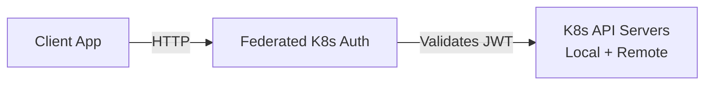

# Federated K8s Auth

Centralized JWT token validation service for Kubernetes ServiceAccount authentication across multiple clusters.

## Features

- JWT signature verification using OIDC discovery and JWKS
- Multi-cluster support with centralized configuration
- Auto-detection of local Kubernetes cluster
- JWKS caching with TTL
- Custom CA certificate support
- Simple HTTP API

## Architecture



## Quick Start

### Install dependencies

```bash
npm install
```

### Run locally

```bash
# Create config file
cp config/clusters.example.yaml config/clusters.yaml

# Start server
npm start
```

### Build Docker image

```bash
docker build -t federated-k8s-auth:latest .
```

## API Endpoints

### POST /api/v1/validate

Validate a JWT token.

**Request:**
```json
{
  "cluster_name": "production-us",
  "token": "eyJhbGc..."
}
```

**Response (Success - HTTP 200):**
```json
{
  "authenticated": true,
  "username": "production-us/app-ns/user1",
  "expiration": 1735689600,
  "issued_at": 1735686000
}
```

**Response (Auth Failure - HTTP 401):**
```json
{
  "authenticated": false,
  "error": "invalid_signature",
  "message": "Token signature verification failed"
}
```

**Response (Bad Request - HTTP 400):**
```json
{
  "authenticated": false,
  "error": "cluster_not_found",
  "message": "No configuration found for cluster: unknown-cluster"
}
```

### GET /health

Health check endpoint.

**Response:**
```json
{
  "status": "ok",
  "clusters": 2
}
```

### GET /api/v1/clusters

List configured clusters (debug).

**Response:**
```json
{
  "clusters": ["local", "production-us"],
  "count": 2
}
```

## Configuration

### Environment Variables

- `PORT` - Server port (default: 8080)
- `CLUSTER_CONFIG_PATH` - Path to clusters.yaml file

### Cluster Configuration

Create a `clusters.yaml` file:

```yaml
clusters:
  # Auto-detect local cluster
  - name: local
    auto: true

  # External cluster
  - name: production-us
    issuer: https://kubernetes.default.svc.cluster.local
    api_server: https://10.20.30.40:6443
    ca_cert_path: /etc/secrets/prod-us-ca.crt
    token_path: /etc/secrets/prod-us-token
```

## Deployment

### Deploy to Kubernetes

Kubernetes manifests are located in the root `k8s/` directory:

```bash
# Deploy all components
kubectl apply -f ../k8s/cluster-a/federated-k8s-auth-serviceaccount.yaml
kubectl apply -f ../k8s/cluster-a/federated-k8s-auth-configmap.yaml
kubectl apply -f ../k8s/cluster-a/federated-k8s-auth-deployment.yaml
kubectl apply -f ../k8s/cluster-a/federated-k8s-auth-service.yaml
kubectl apply -f ../k8s/cluster-a/federated-k8s-auth-networkpolicy.yaml

# Verify deployment
kubectl get pods -l app=federated-k8s-auth -n mariadb-auth-test
kubectl logs -l app=federated-k8s-auth -n mariadb-auth-test
```

## Development

### Run tests

```bash
npm test
```

### Watch mode

```bash
npm run dev
```

## HTTP Status Codes

- **200 OK** - Successful authentication
- **400 Bad Request** - Invalid request (missing params, cluster_not_found)
- **401 Unauthorized** - Authentication failed (invalid token, expired, etc.)
- **404 Not Found** - Unknown endpoint
- **500 Internal Server Error** - Server error

## Error Codes

- `invalid_request` - Missing or invalid request parameters (400)
- `cluster_not_found` - Unknown cluster name (400)
- `invalid_token` - Malformed JWT (401)
- `invalid_signature` - Signature verification failed (401)
- `token_expired` - Token has expired (401)
- `jwks_fetch_failed` - Failed to fetch JWKS (500)
- `oidc_discovery_failed` - Failed to fetch OIDC configuration (500)
- `internal_error` - Unexpected server error (500)
